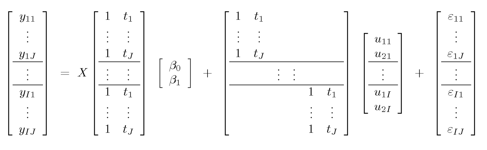

```{r setup, include=FALSE, warning=FALSE}
knitr::opts_chunk$set(echo = TRUE)
set.seed(2020)

install.packages("dplyr", repos =  "http://cran.us.r-project.org") #1.0.0

libs <- c("tidyverse", "knitr", "kableExtra", "gridExtra", "grid",
          "ggpubr", "modelr", "gganimate", "gifski", "png", "rstan", "brms",
          "tidybayes", "bayesplot", "loo", "extraDistr")

not_found <- libs[!(libs %in% installed.packages()[,"Package"])]
if(length(not_found)){
  install.packages(not_found, repos =  "http://cran.us.r-project.org")
  }

```

## Intro
The following code aims to be a step-by-step walkthrough on how to implement and evaluate a Bayesian Linear Mixed Effects model for simulated website bounce rate data across English counties. The response variable $y$ is website bounce rate in seconds (bounce rate = time a user spends on a website), and independent variable are `age` (user age) and `location` (county).


## Load Packages
```{r load_packages, message=FALSE}

require(tidyverse)
require(dplyr) # dplyr 1.0.0
require(knitr)
require(kableExtra)
require(gridExtra)
require(grid)
require(ggpubr)
require(modelr)

# Animation library
require(gganimate)
require(gifski)
require(png)

# Mixed Effects Model libraries
require(rstan)
require(brms)
require(tidybayes)
require(bayesplot)
require(loo)

# Prior libraries
require(extraDistr)
```

## Load Data
```{r}
#cols() suppresses messages
bounce_data <- read_csv("../../data/bounce_rates_sim.csv", 
                        col_types = cols() )  %>% 
  mutate(county = as.factor(county))

kable(bounce_data) %>% 
kable_styling(bootstrap_options = c("striped", "hover", "condensed", "responsive")) %>%
  row_spec(0, background = "#4CAF50", color="#FFF")  %>% 
  scroll_box(width = "100%", height = "200px") 
```

```{r}
summary(bounce_data)
```

## Preprocess data
Standardize (center-scale) `age` variable

```{r}
# Standardize data
bounce_data <- bounce_data %>% 
  mutate(std_age = scale(age)[,1]) %>% 
  dplyr::relocate(std_age, .after=age)
  
# Example std_age data
summary(bounce_data)

```


## Exploratory Data Analysis {.tabset .tabset-fade .tabset-pills}

Using a ground-up approach to modeling, we combine an EDA + modeling step to guide our modeling approach in an iterative fashion. First build a baseline model (doesn't have to be Bayesian) where we start simple and build up based on how we see the model performs

### **Base Model**

A simple linear regression for example. The model doesn't to perform well, for example it has a small $Adj\ R^2$ value, the residual vs fitted plot shows heteroscedastic variance (i.e. there's a trend), and when we plot the data with the trendline estimated with this model we see it might not capture group differences leading to an example of Simpson's paradox.

```{r}
base_model <- lm(bounce_time ~ std_age, data=bounce_data)

summary(base_model)
```

```{r message=FALSE}
ggplot(base_model) + 
  geom_point(aes(x=.fitted, y=.resid)) +
  geom_smooth(aes(x=.fitted, y=.resid), se = FALSE ) +
  labs(x = "Fitted", y="Residuals", title="Variance isn't constant (homoscedastic), we see a fanning down trend" )
```

```{r message=FALSE}
ggplot(bounce_data, aes(x = std_age, y = bounce_time, color=county)) + 
  geom_smooth(data=bounce_data, aes(x=std_age, y=bounce_time),
              method="lm", inherit.aes = FALSE, se=FALSE, color="black", size=0.9) +
  geom_point(alpha=0.5) +
  labs(x = "Age (standardized)", y="Bounce rates (secs)", title="The line seems to capture the overall population trend, but might miss group trends (Simpson's paradox)" ) +
  theme(title = element_text(size=8))

```


### **Mixed effects**

Building on the previous notion that there might be differences between groups (i.e sources of heterogeneity) we now approach the data with a mixed effects model.

$$Y = X\boldsymbol{\beta} + Z\boldsymbol{u} + \epsilon$$



where $J$ denotes groups, $X$ is a matrix of all observations, $\beta$ is  vector of **fixed effects** (i.e. $\beta_0$ and $\beta_1$), $Z$ is a matrix representation of group-specific observations, $\gamma$ is a vector of **random effects** (e.g. $b_{0,j}$ and/or $b_{1,j}$), and $\epsilon$ is noise vector.

```{r message=FALSE}
ggplot(bounce_data, aes(x = std_age, y = bounce_time, color=county)) + 
  geom_smooth(data=bounce_data, aes(x=std_age, y=bounce_time),
              method="lm", inherit.aes = FALSE, se=FALSE, color="black", size=0.9)+
  geom_smooth(method="lm") + 
  geom_point(alpha=0.5) +
  labs(x = "Age (standardized)", y="Bounce rates (secs)", title="County intercepts seems to vary the most, while slopes seem very similar" ) +
  theme(title = element_text(size=9))
  

```

From the plot above we can quickly see that most heterogeneity between counties comes from varying-intercepts. However, we also see there is a little variability in slopes.

Thus, we will fit both models (varying-intercepts and varying-intercepts, varying-slopes) and assess which one works best.


## Bayesian Modeling

The first step in defining a Bayesian model is selecting a set of priors. In our case, we're defining a Bayesian Linear Mixed Effects model which assumes data is normally distributed and varies across groups.

</br> </br>

### Prior predictive checks {.tabset .tabset-fade .tabset-pills}

When selecting prior we would like to select those that are considered to be *weakly informative* and ideally conjugate. The former, simply refers to selecting a set of priors that would generate **plausible** data sets similar to our observed data, while the later helps define the model as a generative model. People might confuse *weakly informative* to be diffuse distributions, however this might generate **impossible** data sets (e.g. very extreme values) which might be detrimental.

Practically this means we'll generate various simulated data sets based on set of prior, and check that these provide plausible values.

#### **Random intercept model**

Mathematically, this model is defined as follows
$$ y_{i,j} \sim N( \beta_0 + b_{0,j} + \beta_1 x_{i,j}, \sigma^2)\\ 
b_{0,j} \sim N(0, \tau^2)$$

and we need to set priors for the following parameters - $\sigma$, $\tau$, $\beta_0$ and $\beta_1$

Here we choose priors for intercept around sample mean of 200 and for the slope of about 1 given what we've observed for each group (i.e. intercepts varying across the 200s and population slope is 4). Thus, we set $\tau \sim N_+(0,10)$ and $\sigma \sim N_+(0,100)$, while $\beta_0\sim N(200,1)$ and $\beta_1 \sim N(4,1)$.

```{r}
seed_nums <- 1:10
sim_df <- tibble(sim_no = integer(),
                 raw = numeric(),
                 y_sim = numeric())

# Generate a flip-book of simulations
for (i in 1:length(seed_nums)){
  set.seed(i)
  # Variance / std deviation priors
  tau <- abs(rnorm(1, 0, sd = 10))
  sigma <- abs(rnorm(1, 0, sd = 100))
  epsilon <- rnorm(nrow(bounce_data), mean=0, sd=sigma)
  
  # Fixed / Random effects priors
  b0 <- rnorm(8, mean=0, sd=tau)
  beta0 <- rnorm(1, mean=200, sd=1)
  beta1 <- rnorm(1, mean=4, sd=1)

  # Simulated df
  sims <- tibble(sim_no = i,
                 raw = bounce_data$bounce_time,
                 y_sim = beta0 + b0[bounce_data$county] + beta1*bounce_data$std_age + epsilon)
  
  sim_df <- bind_rows(sim_df, sims)
  
}


animate(ggplot(sim_df, aes(x=raw, y=y_sim)) +
  geom_point() +
  ggtitle("Random intercept model: notice changing y-axis, values are plausible yet not identical",
          subtitle = 'Simulation #: {closest_state}') +
  labs(x= "Bounce rates (sec)", y="Simulated rates (secs)") +
  theme(title= element_text(size=7)) +
  transition_states(as.factor(sim_no),
                    transition_length = 1,
                    state_length = 10) +
  view_follow(),
  fps =3, res=120, width=700, height=600)

```

</br>

##### **Example of "Non-informative priors" and where it might go wrong**


Here $\beta_j \sim N(0,100)$ and $\tau \sim Inv-Gamma(1,100)$ are considered  diffuse priors (i.e. very vague)

```{r}
tau <- sqrt(rinvgamma(1, alpha=1, beta=100))
sigma <-  sqrt(rinvgamma(1, alpha=1, beta=100))
epsilon <- rnorm(nrow(bounce_data), mean=0, sd=sigma)
  
# Fixed / Random effects priors
b0 <- rnorm(8, mean=0, sd=tau)
beta0 <- rnorm(1, mean=0, sd=100)
beta1 <- rnorm(1, mean=0, sd=100)

# Simulated df
sims <- tibble(raw = bounce_data$bounce_time,
               y_sim = beta0 + b0[bounce_data$county] + beta1*bounce_data$std_age + epsilon)
  
  
ggplot(sims, aes(x=raw, y=y_sim)) +
  geom_point(alpha=0.5, color="blue") +
  labs(x="Bounce rates(secs)", y="Simulated rates", 
       title = "We see half of the simulated values are quite improbable (i.e. negative or close to zero)")

```


#### **Random intercept + slope model**

Mathematically, this model is defined as follows
$$ y_{i,j} \sim N( \beta_0 + b_{0,j} + (b_{1,j} +\beta_1) x_{i,j}, \sigma^2)\\ 
\begin{pmatrix}b_{0,j}\\b_{1,j}\end{pmatrix} \sim N\left(0, \begin{pmatrix}\tau_{00} & \tau_{01}\\ \tau_{10} & \tau_{11}\end{pmatrix}\right)$$

and we need to set priors for the following parameters - $\sigma$, $\tau_0$, $\tau_1$, $\beta_0$ and $\beta_1$

We choose similar prior as before and add $\tau_1 \sim N_+(0,10)$ to the set of priors.

```{r}
seed_nums <- 1:10
sim_df <- tibble(sim_no = integer(),
                 raw = numeric(),
                 y_sim = numeric())

# Generate a flip-book of simulations
for (i in 1:length(seed_nums)){
  set.seed(i)
  # Variance / std deviation priors
  tau0 <- abs(rnorm(1, 0, sd = 10))
  tau1 <- abs(rnorm(1, 0, sd = 10))
  sigma <- abs(rnorm(1, 0, sd = 100))
  epsilon <- rnorm(nrow(bounce_data), mean=0, sd=sigma)
  
  # Fixed / Random effects priors
  b0 <- rnorm(8, mean=0, sd=tau0)
  b1 <- rnorm(8, mean=0, sd=tau1) 
  beta0 <- rnorm(1, mean=200, sd=1)
  beta1 <- rnorm(1, mean=4, sd=1)

  # Simulated df
  sims <- tibble(sim_no = i,
                 raw = bounce_data$bounce_time,
                 y_sim = beta0 + b0[bounce_data$county] + (b1[bounce_data$county] + beta1)*bounce_data$std_age + epsilon)
  
  sim_df <- bind_rows(sim_df, sims)
  
}


animate(ggplot(sim_df, aes(x=raw, y=y_sim)) +
  geom_point() +
  ggtitle("Random intercept/slope model: notice changing y-axis, values are plausible yet not identical",
    subtitle = 'Simulation #: {closest_state}') +
  labs(x= "Bounce rates (sec)", y="Simulated rates (secs)") +
  theme(title= element_text(size=7)) +
  transition_states(as.factor(sim_no),
                    transition_length = 1,
                    state_length = 10) +
  view_follow(),
  fps =3, res=120, width=700, height=600)

```


</br> </br>

### Model fitting {.tabset .tabset-fade .tabset-pills}

Now that we've gotten a sense about priors we can now fit Bayesian models using `brms` which runs on `rstan` and uses familiar, easy-to-use formula builder (same as `lme4`).

Here we'll fit the 3 Bayesian mentioned above: Simple Linear Regression, Random Intercept Model and Random Intercept + Slope Model

#### **Simple Linear Regression Fit**

```{r}

# If you are unsure on how to set up priors, you can use get_priorfunction to see how to specify them
#get_prior(bounce_time ~ std_age, data=bounce_data)
if (!file.exists("models/lin_reg.rds")){
  lin_reg <-  brm(bounce_time ~ std_age, 
                  data=bounce_data,
                  family = gaussian(),
                  prior= c(prior(normal(200, 1), class = Intercept), # intercept prior
                           prior(normal(4, 1), class = b), # fixed effects prior
                           prior(normal(0, 100), class = sigma) # default lower bound is 0 (i.e truncated)
                  ),
                  warmup = 1000, # burn-in
                  iter = 5000, # number of iterations
                  chains = 2,  # number of MCMC chains
                  control = list(adapt_delta = 0.95))
  
  saveRDS(lin_reg, file="models/lin_reg.rds")
} else {
  lin_reg <- readRDS("models/lin_reg.rds")
}

summary(lin_reg)

```

</br> 

##### **MCMC diagnostics**

We do some early diagnostics on the posterior parameter inferences and the MCMC chains (i.e. traceplots and autocorrelation).

HMC (Hamiltonian Monte Carlo) tends to provide good mixing of MCMC chains and low autocorrelation (still computed here), however there are additional diagnostics (i.e. transition divergence) that can be useful to look at with HMC sampling.

This later part is particularly important if the `brms` fit output warns us that there seems to be divergent transitions.


```{r}
# get naming of variables
#get_variables(lin_reg) 

## Divergence
color_scheme_set("darkgray")
d1 <- mcmc_scatter(
  as.matrix(lin_reg),
  pars = c("sigma", "b_Intercept"),
  alpha = 2/3,
  np = nuts_params(lin_reg),
  np_style = scatter_style_np(div_color = "green", div_size = 2.5, div_alpha = 0.75)) 

d2 <- mcmc_scatter(
  as.matrix(lin_reg),
  pars = c("sigma", "b_std_age"),
  alpha = 2/3,
  np = nuts_params(lin_reg),
  np_style = scatter_style_np(div_color = "green", div_size = 2.5, div_alpha = 0.75))

grid.arrange(d1,d2, ncol=2, 
             top = textGrob("Linear Regression HCM Divergence plots: \n No divergence (green) encountered, thus space was explored entirely",gp=gpar(fontsize=12,font=1))) 

# Numeric check of divergence
# lin_reg %>% 
#  spread_draws(divergent__) %>% 
#  mean_hdi()


## Traceplots
color_scheme_set("mix-brightblue-gray")
mcmc_trace(lin_reg,  pars = c("b_Intercept", "b_std_age", "sigma"), n_warmup = 500,
                facet_args = list(ncol = 2, labeller = label_parsed)) +
  labs(x = "Iteration", title="Linear Regression MCMC chain traceplot seems to mix well")
  
## Autocorrelation
mcmc_acf(lin_reg, pars = c("b_Intercept", "b_std_age", "sigma"), lags = 15) +
  ggtitle("Linear Regression ACF plot",
          subtitle="MCMC ACF for all params seems to have at most lag 1-2 which is desirable")
```


#### **Random Intercept Fit**

Here we fit the random intercept model as defined previously

```{r}
#get_prior(bounce_time ~ std_age + (1|county), data=bounce_data)

if (!file.exists("models/r_intercept.rds")){
  bayes_rintercept <- brm(bounce_time ~ std_age + (1|county),
                          data = bounce_data,
                          prior = c(prior(normal(200, 1), class = Intercept), # intercept prior
                                    prior(normal(4, 1), class = b), # fixed effects prior
                                    prior(normal(0, 100), class = sigma), # population variance
                                    prior(normal(0, 10), class = sd)), # i.e. tau, group variance
                          warmup = 1000, # burn-in
                          iter = 5000, # number of iterations
                          chains = 2,  # number of MCMC chains
                          control = list(adapt_delta = 0.95)) 

  saveRDS(bayes_rintercept, file= "models/r_intercept.rds")
  
} else {
  bayes_rintercept <- readRDS("models/r_intercept.rds")
}

summary(bayes_rintercept)
```

</br> 

##### **MCMC diagnostics**

We perform similar checks and notice there isn't any lack of chain mixing, autocorrelation issues or divergence in the HMC sampling

```{r warning=FALSE}
# get naming of variables
#get_variables(bayes_rintercept) 

## Divergence 
color_scheme_set("darkgray")
mcmc_scatter(
  as.matrix(bayes_rintercept),
  pars = vars(contains("devon"), contains("kent")),
  np = nuts_params(bayes_rintercept),
  np_style = scatter_style_np(div_color = "green", div_alpha = 0.75)) +
  labs(x = "Devon rand intercept", y = "Kent rand intercept") +
  ggtitle("HMC Divergence Random Intercept model",
          subtitle = "Example of Devon vs Kent random intercepts, no divergence found")

# Numeric check of divergence
# bayes_rintercept %>% 
#  spread_draws(divergent__) %>% 
#  mean_hdi()

# Traceplots
color_scheme_set("mix-brightblue-gray")
mcmc_trace(bayes_rintercept,  pars = vars(sigma, starts_with("b_")),
           regex_pars = "r_county.*", n_warmup = 500,
           facet_args = list(ncol = 4, labeller = label_parsed)) +
  labs(x = "Iteration", title="Random Intercept MCMC chain traceplots seem to mix well")


## Autocorrelation
mcmc_acf(bayes_rintercept, pars = vars(starts_with("r_county[")),
         lags = 10,
         facet_args = list( labeller = label_parsed)) +
  ggtitle("Random Intercept ACF plot",
          subtitle="MCMC ACF for all params seems to have at most lag 1-2 which is desirable") +
  theme(text = element_text(size = 8))

```

#### **Random Intercept + Slope Fit**

We then fit a random intercept and slopes model as specified above

```{r}

#get_prior(bounce_time ~ std_age + (1 + std_age |county), data=bounce_data)

if (!file.exists("models/r_slope.rds")){
  
  bayes_rslope <- brm(bounce_time ~ std_age + (1 + std_age|county),
                        data = bounce_data,
                        prior = c(prior(normal(200, 1), class = Intercept), # intercept prior
                                  prior(normal(4, 1), class = b), # fixed effects prior
                                  prior(normal(0, 100), class = sigma), # population variance
                                  prior(normal(0, 10), class = sd, 
                                        group=county, coef="Intercept"), #tau 0
                                  prior(normal(0, 10), class = sd, 
                                        group=county, coef="std_age")),  #tau 1
                        warmup = 1000, # burn-in
                        iter = 5000, # number of iterations
                        chains = 2,   # number of MCMC chains
                        control = list(adapt_delta = 0.95))
  
  saveRDS(bayes_rslope, file="models/r_slope.rds")
} else {
  bayes_rslope <- readRDS("models/r_slope.rds")
}


summary(bayes_rslope)
```

</br>

##### **MCMC diagnostics**

Similar checks show no issues on chain mixing, autocorrelation or divergence in the HMC sampling

```{r}

# get_variables(bayes_rslope) 

## Divergence
color_scheme_set("darkgray")
mcmc_scatter(
  as.matrix(bayes_rslope),
  pars = vars(contains("kent")),
  np = nuts_params(bayes_rintercept),
  np_style = scatter_style_np(div_color = "green", div_alpha = 0.75)) +
  labs(x = "Kent rand intercept", y = "Kent rand slope") +
  ggtitle("HMC Divergence Random Intercept model",
          subtitle = "Example of Kent random effects, no divergence found")


# Numeric check of divergence
# bayes_rslope %>% 
#  spread_draws(divergent__) %>% 
#  mean_hdi()


## Traceplots
color_scheme_set("mix-brightblue-gray")

mcmc_trace(bayes_rslope,  pars = vars(contains("std_age")), 
           n_warmup = 500,
           facet_args = list(ncol = 4, labeller = label_parsed)) +
  labs(x = "Iteration") +
  ggtitle("Random Intercept + Slope Model MCMC Traceplot",
          subtitle="Slope (fixed + random) estimates") +
  theme(text=element_text(size=7),
        title = element_text(size=10))
  
## Autocorrelation
mcmc_acf(bayes_rslope, pars = vars(matches("^r_county.*Intercept")), 
         lags = 10,
         facet_args = list(labeller = label_parsed)) +
  ggtitle("Random Intercept + Slope Model  ACF plot",
          subtitle="MCMC ACF random intercepts seem to have slight autocorrelatione") +
  theme(text=element_text(size=7),
        title = element_text(size=10))


```


## Model Comparison

### Posterior Predictive Checks  {.tabset .tabset-fade .tabset-pills}

We use posterior predictive checks to evaluate our models. Here we cover some qualitative and quantitative posterior predictive checks that can help in our model comparison.

For these checks we simulate from the posterior predictive distribution (i.e. sample from the posterior predictive distribution)
$$p(\tilde{y} \mid y) = \int p(\tilde{y} | \theta)\; p(\theta | y)\;  d \theta$$
where y are our observations, $\tilde{y}$ is new data to be predicted, and $\theta$ are model parameters (inferred via the Bayesian fit).

#### **Posterior Densities**

First, we compare the simulated vs observed densities of `bounce_time`. We observe that the mixed effects models seem to simulate data that is similar to the empirical data compared to simulated simple linear regression.

```{r}
# Plot posterior simulated densities 

# Get observed values
y_obs <- bounce_data$bounce_time

# Linear regression
color_scheme_set("red")
pdense1 <- ppc_dens_overlay(y = y_obs,
                           yrep = posterior_predict(lin_reg, nsamples = 100)) +
  labs(x = "Bounce time (s)", y ="Density", title = "Linear Regression") +
  theme(title = element_text(size=10))

# Random Intercept
color_scheme_set("gray" )
pdense2 <- ppc_dens_overlay(y = y_obs,
                           yrep = posterior_predict(bayes_rintercept, nsamples = 100)) +
  labs(x = "Bounce time (s)", title = "Random Intercept") +
  theme(title = element_text(size=10))

# Random Slope
color_scheme_set("teal")
pdense3 <- ppc_dens_overlay(y =y_obs,
                           yrep = posterior_predict(bayes_rslope, nsamples = 100)) +
  labs(x = "Bounce time (s)", title = "Random Intercept + Slope") +
  theme(title = element_text(size=10))
  

# Aggregate and plot pictures side-by-side
ppc_figure <- ggarrange(pdense1, pdense2, pdense3, ncol=3,
                        common.legend = TRUE, legend = "bottom",
                        font.label = list(size=10))

annotate_figure(ppc_figure,
               top = text_grob("Posterior predictive draws (y_rep) for each model vs observed data (y)"))


```

#### **Posterior Summary Statistics**

Next, we look at some summary statistics. Given posterior predictive checks use data twice (i.e. one for fitting and one for checking), we look at summary statistics unrelated to any of the parameters we updated. In our case, we will use median and skewness instead of mean and variance (which we inferred). 

Below is an example of why we'd look at unrelated summary statistics. We observe that all model simulations seems to capture the observed mean of `bounce_time`, however when we look at the skweness we observe the simple regression model simulations don't reflect the observed data's skewness.

```{r warning=FALSE, message=FALSE}
# Fisher Pearson skew https://www.itl.nist.gov/div898/handbook/eda/section3/eda35b.htm
skew <- function(y){
  n <- length(y)
  dif <- y - mean(y)
  skew_stat <- (sqrt(n-1)/(n-2))*n *(sum(dif^3)/(sum(dif^2)^1.5))
  return(skew_stat)
}


# Helper function to plot PPC test statistic plots
posterior_stat_plot <- function(obs, model, samples=1000, statistic="mean"){
  fig <- ppc_stat(y = obs, 
                   yrep = posterior_predict(model, nsamples = samples),
                   stat = statistic)
  
  return(fig)
}

# Linear Reg Mean and skewness
color_scheme_set("red")
pmean1 <- posterior_stat_plot(y_obs, lin_reg) + labs(y="Linear Regression") +
  theme(legend.text = element_text(size=8), 
        legend.title = element_text(size=8))

pskew1 <- posterior_stat_plot(y_obs, lin_reg, statistic = "skew") +
  theme(legend.text = element_text(size=8),
        legend.title = element_text(size=8))

# Random Intercept Mean and skewness
color_scheme_set("gray")
pmean2 <- posterior_stat_plot(y_obs, bayes_rintercept) + labs(y="Random Intercept")
pskew2 <- posterior_stat_plot(y_obs, bayes_rintercept, statistic = "skew")

color_scheme_set("teal")
pmean3 <- posterior_stat_plot(y_obs, bayes_rslope) +
  labs(x = "Mean", y ="Random Intercept + Slope")

pskew3 <- posterior_stat_plot(y_obs, bayes_rslope, statistic = "skew") +
  labs(x = "Fisher-Pearson Skewness Coeff")

# Random Slope Mean and skewness
ppc_stat1_figure <- ggarrange(pmean1, pskew1, legend="top",
                        font.label = list(size=10))
ppc_stat2_figure <- ggarrange(pmean2, pskew2, legend = "none",
                        font.label = list(size=10))
ppc_stat3_figure <- ggarrange(pmean3, pskew3, legend= "none",
                              font.label = list(size=10))

stat_figure <- ggarrange(ppc_stat1_figure, ppc_stat2_figure, ppc_stat3_figure, nrow=3)

annotate_figure(stat_figure,
               top = text_grob("Posterior test statistics T(y_rep) for each model vs observed data T(y)"))
```

Similarly, we can look at how each model's simulations captures each group's median instead of the mean. Again we observe the mixed effects models capture each county's median compared to the simple linear regression.

```{r message=FALSE}
# Compute PPC test statistics per group for each model

# Linear regression
color_scheme_set("red")
med_figure <- ggarrange(lin_reg %>% 
                          posterior_predict(nsamples=500) %>% 
                          ppc_stat_grouped(y = y_obs,
                                           group = bounce_data$county, stat = "median") +
                          ggtitle("Linear Regression") +
                          theme(title = element_text(size=10)),
                        nrow = 1, legend = "none")

annotate_figure(med_figure,
               top = text_grob("Posterior median T(y_rep) for each model vs observed data T(y) across counties"))

# Random Intercept
color_scheme_set("gray")
ggarrange(bayes_rintercept %>% 
            posterior_predict(nsamples=500) %>% 
            ppc_stat_grouped(y = y_obs,
                             group = bounce_data$county, stat = "median") + 
            ggtitle("Random Intercept") +
            theme(title = element_text(size=10)),
          nrow = 1, legend = "none")

# Random slope
color_scheme_set("teal")
ggarrange(bayes_rintercept %>% 
            posterior_predict(nsamples=500) %>% 
            ppc_stat_grouped(y = y_obs,
                             group = bounce_data$county, stat = "median") +
            ggtitle("Random Intercept + Slope") +
            theme(title = element_text(size=10)),
          nrow = 1, legend = "bottom")


```


### LOO Cross-validation (Marginal Predictive Checks) {.tabset .tabset-fade .tabset-pills}

We can also perform  check how well our model performs based on marginal predictive distributions $$p(\tilde{y}_i\mid y)$$ rather than using the joint densities as above. This can be useful to find outliers or check overall calibration.

In a Bayesian setting, we can compute leave-on-out cross-validation (LOO CV) via the LOO predictive distribution $$p(y_i \mid y_{-i})$$ via a Pareto-smoothing Importance Sampling method (PSIS).

#### **Calibration**

First, to check overall model calibration we leverage some probability theory, specifically the concept of  [probability integral transform](https://en.wikipedia.org/wiki/Probability_integral_transform). In our case, given we have a continous outcome this means that if the posterior predictive density is the true distribution then its predictive CDF which should follow a Uniform distribution (as $n -> \infty$).

From the graphs below, we see that the linear regression does follow this uniform shape while the mixed effects models seem to show some deviations. This is likely to how the data was simulated and should be taken with a grain of salt for this example, but it should help show another diagnostic tool you can use.

```{r}
# Compute LOO CV for each model, keeping PSIS object for later use
loo1 <- loo(lin_reg, save_psis = TRUE, cores = 2)
lw1 <- weights(loo1$psis_object)

loo2 <- loo(bayes_rintercept, save_psis = TRUE, cores=2)
lw2 <- weights(loo2$psis_object)

loo3 <- loo(bayes_rslope, save_psis = TRUE, cores = 2)
lw3 <- weights(loo3$psis_object)

# Plot predictive CDF to check for uniform distribution
color_scheme_set("red")
pit1 <- ppc_loo_pit_overlay(y_obs, posterior_predict(lin_reg), lw = lw1)

color_scheme_set("gray")
pit2 <- ppc_loo_pit_overlay(y_obs, posterior_predict(bayes_rintercept), lw = lw2)

color_scheme_set("teal")
pit3 <- ppc_loo_pit_overlay(y_obs, posterior_predict(bayes_rslope), lw = lw3)

pit_figure <- ggarrange(pit1, pit2, pit3, ncol=3, 
                        common.legend = TRUE, 
                        legend = "bottom")


annotate_figure(pit_figure,
               top = text_grob("LOO CV Probability Integral Transfrom for each model "))
```

Even if the linear regression model's predictive CDF seems to show a good fit, we can see that the mixed effects models LOO predictive intervals capture the true values better than the linear regression model.

```{r}
# Posterior predictive LOO Interval plots for each model
color_scheme_set("red")
int1 <- ppc_loo_intervals(y_obs, posterior_predict(lin_reg),
                          psis_object = loo1$psis_object, subset = 1:50) +
  theme(axis.title.x = element_blank())
  

color_scheme_set("gray")
int2 <- ppc_loo_intervals(y_obs, posterior_predict(bayes_rintercept), 
                         psis_object = loo2$psis_object, subset = 1:50) +
  theme(axis.title.x = element_blank())

color_scheme_set("teal")
int3 <- ppc_loo_intervals(y_obs, posterior_predict(bayes_rslope),
                             psis_object = loo3$psis_object, subset = 1:50) 

int_figure <- ggarrange(int1, int2, int3, nrow=3, 
                        common.legend = TRUE, 
                        legend = "bottom")

annotate_figure(int_figure,
                top = text_grob("LOO CV Predictive Intervals for first 50 observations for each model "))
```


#### **ELPD Comparisons, Outliers, and Influential Points**

As always we would like to know what the predictive accuracy of our models is given some out-of-sample data (which is unknwown). In Bayesian modeling, we can do so via an expected out-of-sample log predictive density (ELPD) which is also called the expected log predictive density. This basically averages the model's predictive performance over the distribution of future data.

We compute the overall ELPD for each model via LOO CV log-predictive values, and can use it to compare the expected predictive performance of each model. Here the random intercept model seems to perform best (i.e. 0.0 which is the baseline). The more negative this difference is, the worse the model performs.

```{r}
# Compare ELPD between models
comp <- loo_compare(loo1, loo2, loo3)

comp
```


We can also use LOO log-predictive to find observations that are difficult to predict amongst models (i.e. outliers or high influence points). In terms of model comparison we can look at which model best captures these observations. 

We can do this via ELPD pointwise comparison between models, as well as looking at some diagnostics related to the PSIS method used to compute the LOO log-predictive densities.

Depending on how model values are compared (i.e. Model1 - Model2 vs Model2 - Model1), postivie or negative differences indicate better performing models. In this case, the left figure shows that the random intercept model outperforms the linear regression model overall (positive values) while the right one shows it outperforms the random slope model (negative values) too. 

```{r}
# Obtain pointwise ELPD values
elpd1 <- loo1$pointwise[,"elpd_loo"]
elpd2 <- loo2$pointwise[,"elpd_loo"]
elpd3 <- loo3$pointwise[,"elpd_loo"]

# Build differences dataframe
elpd_df <- tibble(county = bounce_data$county,
                  diff12 = elpd2 - elpd1,
                  diff23 = elpd3 - elpd2) %>% 
  mutate(idx = 1:n())

# Plot each difference individually
pw_elpd1 <- ggplot(elpd_df, aes(x = idx, y = diff12, color = county)) +
  geom_point(alpha=0.7) +
  geom_hline(aes(yintercept=0)) +
  theme_bw() + 
  labs(x = "Index", y = "ELPD Difference",
       title = "Random Intercept - Linear Regression ", color="County") +
  theme(title = element_text(size=8))

pw_elpd2 <- ggplot(elpd_df, aes(x = idx, y = diff23, color = county)) +
  geom_point(alpha=0.7) +
  geom_hline(aes(yintercept=0)) +
  theme_bw()+
  labs(x = "Index",
       title = "Random Intercept/Slope - Random Intercept")+
  theme(axis.title.y = element_blank(),
        title = element_text(size=8))

# Group figures from above
annotate_figure(ggarrange(pw_elpd1, pw_elpd2, common.legend = TRUE, legend = "bottom"),
                top = text_grob("LOO ELPD Pointwise Model comparisons, Random Intercept model performs best"))
```

We can look at some PSIS diagnostics, to get a sense of why the random intercept outperforms the random slope. Below are the values for the Pareto k $\hat{k}$ diagnostic which is related to the variance of this type of importance sampler. 

Briefly, $\hat{k} < 0.5$ indicates the importance weights have finite variance and the model has converged which translated to the model having low RMSE. If instead $0.5 \leq \hat{k} < 0.7$ then PSIS importance weights have finite variance, however the convergence slows as we increase the value. If the value is $\hat{k} > 0.7$, then we can't assure convergence and the estimated value aren't reliable.

In our case, none are greater than 0.5 however we can notice that the random intercept model resolves these values better than the random slope ($\hat{k}_{intercept} < \hat{k}_{slope}$ and are closely distributed around $y=0$)

```{r}
# Get khat values
k_rintercept <- loo2$psis_object$diagnostics$pareto_k
k_rslope <- loo3$psis_object$diagnostics$pareto_k

# Plot values
tibble(idx = seq_along(k_rintercept), 
       r_intercept = k_rintercept,
       r_slope = k_rslope) %>% 
  pivot_longer(cols = -idx) %>% 
  ggplot(., aes(x = idx, y = value, color = name)) +
  geom_point(alpha=0.5) +
  geom_hline(aes(yintercept=0)) +
  theme_bw() +
  ylim(-1,1) +
  facet_wrap(~ name) +
  labs(y = expression(hat(k)), x ="Observation Index") +
  ggtitle("Pareto-k diagnostic (PSIS diagnostic), no influence points (k<0.7)",
          subtitle = "Random intercept models resolves left observation better")


```


## Final Model

From the diagnostics above it is clear that the best model is the random intercept model, which I summarize its effects below

```{r message=FALSE, warning=FALSE}

#Posterior estimates
post_beta_means <- bayes_rintercept %>% 
  recover_types(bayes_rintercept) %>% 
  gather_draws(b_Intercept, b_std_age, sigma,
               sd_county__Intercept) %>% 
  median_hdi() %>% 
  dplyr::select(1:4)

kable(post_beta_means, col.names = c("Variable", "Estimate", "Q2.5", "Q97.5"),
      caption = "Random Intercept Fixed Effects Posterior Median and 95% HPDI ") %>%
  kable_styling(bootstrap_options = c("striped", "hover", "condensed", "responsive")) %>%
  row_spec(0, background = "#4CAF50", color="#FFF")  %>% 
  scroll_box(width = "100%", height = "200px") 


# Random effect estimates + 95% HDPI
bayes_rintercept %>% 
  spread_draws(r_county[county]) %>%
  ggplot(aes(y = fct_rev(county), x = r_county, fill=fct_rev(county))) +
  geom_vline(aes(xintercept=0), alpha=0.5, linetype=2) +
  stat_halfeyeh(.width = c(0.5, .95), point_interval= median_hdi,
                alpha=0.8) +
  labs(x = "Estimate Values", y = "County" ) +
  ggtitle("Random Intercept Estimates per county",
          subtitle = "Median + 95% HPD Interval ") +
  theme_bw() +
  theme(legend.position = "None")
```

We can also visualize the expected posterior predicted lines and associated uncertainty using `add_fitted_draws` 

```{r}

bounce_data %>% 
  group_by(county) %>% 
  data_grid(std_age = seq_range(std_age, n = 101)) %>% 
  add_fitted_draws(bayes_rintercept, n=100) %>%
  ggplot(aes(x = std_age, y = bounce_time, color = ordered(county))) +
  stat_lineribbon(aes(y = .value), alpha=0.9) +
  geom_point(data = bounce_data, alpha=0.7) +
  theme_bw() +
  scale_fill_brewer(palette = "Greys") +
  scale_color_brewer(palette = "Dark2", guide="none") +
  facet_wrap(~county, scales = "free") +
  theme(legend.position = "bottom",
        legend.text = element_text(size=8),
        legend.title = element_text(size=8),
        axis.title = element_text(size=8),
        axis.text = element_text(size=8)) +
  labs(fill= "Confidence level", x = "Age (standardize)", y="Bounce time (s)") +
  ggtitle("Expected Posterior predicted fits + 95% CI",
          subtitle = "Counties with less samples exhibit higher uncertainty")


```

## References

1. Gelman, A., Carlin, J. B., Stern, H. S., Dunson, D. B., Vehtari, A., & Rubin, D. B. (2013). Bayesian data analysis. CRC press.

2. Gabry, Jonah, et al. “Visualization in Bayesian workflow.” Journal of the Royal Statistical Society: Series A (Statistics in Society) 182.2 (2019): 389–402.

2. BRMS. https://paul-buerkner.github.io/brms/