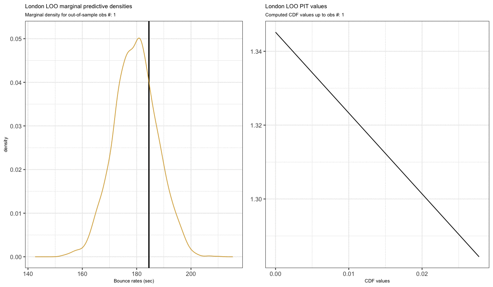

```{r setup, include=FALSE}
knitr::opts_chunk$set(echo = TRUE)
```

# Background

Model checking is an essential part of any model development process. Bayesian model checking is normally performed via *posterior predictive checks* which involve looking at posterior densities and test statistics from the joint distribution.

However, sometimes we're also interested in detecting unusual observations such as outliers and influential points, or checking how well our model is specified across observations. Looking joint distribution won't help us answer these questions, so instead we look at the marginal (i.e. univariate) posterior predictive distributions. One way to obtain these marginal samples is via leave-on-out cross-validation (LOO CV)  predictive density.

$$p(y_i \mid y_{-i} ) = \int p(y_i \mid \theta) \; p(\theta \mid y_{-i}) \; d \theta$$

This can be computationally intensive so there [ways to approximate these distributions](https://mc-stan.org/loo/reference/psis.html) (which I won't cover here).


**In this document I will focus how to use these marginal distributions to check model calibration.**


# Model Calibration

## Intro
>The data and example are based on the following [Towards Data Science article](https://towardsdatascience.com/a-bayesian-approach-to-linear-mixed-models-lmm-in-r-python-b2f1378c3ac8)

In a Bayesian setting, we use some probability theory to test model calibration - specifically, a concept called the probability integral transform (PIT), which basically uses CDF properties to convert continuous random variables into uniformly distributed ones regardless of the underlying distribution that generated them. However, this only holds if the distribution generating the random variables is the true distribution.

So, what does that mean? It means that if our model is a good approximation of the true bounce rate generative distribution, then the set of empirical CDF values generated from each LOO marginal density will be approximately uniform. That is, for each univariate density $p(\tilde{y}_i \mid y_{-i} )$ we compute the CDF value $ p_i = Pr(\tilde{y}_i  \leq  y_i \;\mid\; y_{-i} ) $ and plot the distribution of the $p_i$s.

This might sound like "voodoo magic" to some so instead let's dive into an actual example.

## Base Case

Here I'll load a random intercept model I fit previously.

$$ y_{i,j} \sim N( \beta_0 + b_{0,j} + \beta_1 x_{i,j}, \sigma^2)\\ 
b_{0,j} \sim N(0, \tau^2)$$

which used the following priors: $\tau \sim N_+(0,10)$ and $\sigma \sim N_+(0,100)$, $\beta_0\sim N(200,1)$ and $\beta_1 \sim N(4,1)$.

I will use built-in functions `loo` package to compute the PIT values and plot them using `bayesplot`. We will consider this our standard as we build our intuition.

```{r message=FALSE}
require(tidyverse)
require(brms)
require(loo)
require(bayesplot)
require(gridExtra)
set.seed(2020)

# Load the original data
bounce_data <- bounce_data <- read_csv("../../data/bounce_rates_sim.csv", 
                                       col_types = cols() )  %>% 
  mutate(county = as.factor(county)) %>% 
  mutate(std_age = scale(age))

# load pre-computed model
bayes_rintercept <- readRDS("../R/models/r_intercept.rds")


# LOO packages uses an efficient approximation called Pareto Smoothed Importance Sampling
loo_rint <- loo(bayes_rintercept, save_psis = TRUE, cores=2)
lw <- weights(loo_rint$psis_object)
```

Below we can see that the LOO-PIT values (thick curve) from our model deviate in some places from random samples of a standard uniform (thin curves). Without going much into detail here's who you might interpret one of these plots (remember, these PIT values are computed on an out-of-sample data points):

- **If LOO-PIT values concentrate near 0 or 1**, we have an under-dispersed model (i.e. our pointwise predictive densities are too narrow to capture the correct level of potential variability in data, thus more modeling is required). 

- **If LOO-PIT values concentrate near 0.5**, then we an over-dispersed model (i.e. our pointwise predictive densities are too broad and don't reflect our uncertainty correctly, thus more modeling is required)

In our plot, there doesn't seem to be any miscalibration (given the thick line does follow the behavior plausible uniform random samples ), **but there is definitely a  sticky point around 0.6-0.7** .

Rather than taking my word for let's look of why this is so!

```{r}
# Plot base PIT values
color_scheme_set("gray")
ppc_loo_pit_overlay(bounce_data$bounce_time, 
                    posterior_predict(bayes_rintercept), lw = lw)

```


## Generating the LOO-PIT values

Below is some code to generate these LOO CV densities and associated CDF values. Since the computation **takes AGES** (I'm not exagerating it took like 2 hours for this couple hundred observations), I've loaded some data I previously saved in the next section.

However, feel free to run this code on your own if you'd like to generate a new set of values.

```{r eval=FALSE}
# Allocate CDF value mean vector for each iteration
cdf_vals <- rep(0,nrow(bounce_data))
pdraw <- matrix(0, nrow(bounce_data), 3000)

# Fit first LOO model (i.e. without 1st value)
tmp_data <- bounce_data[-1,]

# Fit model without 1st observation
bayes_rintercept <- brm(bounce_time ~ std_age + (1|county),
                        data = tmp_data,
                        prior = c(prior(normal(200, 1), class = Intercept),
                                  prior(normal(4, 1), class = b),
                                  prior(normal(0, 100), class = sigma),
                                  prior(normal(0, 10), class = sd)), 
                        warmup = 500, # burn-in
                        iter = 2000, # number of iterations
                        chains = 2,  # number of MCMC chains
                        control = list(adapt_delta = 0.95)) 

# Get posterior draw for this first model
pdraw[1,] <- posterior_predict(bayes_rintercept, 
                           newdata = bounce_data[1,])

# Compute first out-of-sample CDF value
cdf_vals[1] <- mean(pdraw[i,] <= bounce_data$bounce_time[1])


# Iterate through the rest of the observations
for (i in 2:nrow(bounce_data)){
  tmp_data <- bounce_data[-i,]
  
  bayes_rintercept <- update(bayes_rintercept, newdata = tmp_data)
  
  # save posterior draws
  pdraw[i,] <- posterior_predict(bayes_rintercept, 
                             newdata = bounce_data[i,])
  
  # save cdf values p_i
  cdf_vals[i] <- mean(pdraw[i,] <= bounce_data$bounce_time[i])  
  
}

```

### A first look at LOO-PIT values

It seems like the process produced a set of LOO-PIT values somewhat similar to that above from the `loo` package with a little sticky point near 0.6.


```{r message=FALSE, fig.width=4, fig.height=4, warning=FALSE}
pdraw <- readRDS("./pdraw.rds")
cdf_vals <- readRDS("./cdf_vals.rds") %>% 
  as_tibble() %>% 
  mutate(county = bounce_data$county)


## LOO-PIT diagram
set.seed(99999)
runif_draws <- sapply(1:50, function(x){runif(613)}) %>% 
  t() %>% as_tibble %>% 
  reshape2::melt()

ggplot() + 
  geom_line(data=runif_draws, 
            aes(x = value, color = variable), 
            alpha=0.2,
            show.legend = FALSE, 
            stat = 'density')  +
  scale_color_manual(values=c(rep('#D3D3D3', 613)) ) +
  geom_density(aes(cdf_vals$value)) +
  theme_bw() +
  theme(axis.title = element_blank())


```

### Generating some intuition {.tabset .tabset-fade .tabset-pills}

Now let's look at how these LOO-PIT (i.e. CDF) values were generated with some visuals to understand where this sticky point comes from.

Below I've plotted the LOO posterior predictive densities (colored lines) per county and associated out-of-sample observed values (vertical lines), so each density is associated with a vertical line to generate a CDF value. Additionally, it is the contribution of the CDF values across the counties that generates the behavior above.

Now, with these individual county plots we are able to look cases that would yield:

1. A **well specified model** (i.e. values uniformly distributed)
2. An **overdispersed model** (i.e. values concentrate at 0.5)
3. An **underdispersed model** (i.e. values concentrate at 0 or 1)

```{r message=FALSE, warning=FALSE}
# Get individual margianl posterior predictive and melt them for facet_wrapping
df <- data.frame(t(pdraw))

df_melt <- reshape2::melt(df) %>% 
  mutate(county =rep(bounce_data$county, each=3000), 
         yobs = rep(bounce_data$bounce_time, each=3000))

ggplot(df_melt, aes(x=value, y=..density.., color=variable))  + 
  geom_vline(aes(xintercept=yobs), alpha=0.1) + 
  geom_line(stat = "density", alpha=0.3) +
  theme_bw() +
  theme(legend.position = "none")  + 
  facet_wrap(~county)


```


#### **A well specified model**

If our model is correctly representing uncertainty and thus well specified, we shouldn't see any pattern on the vertical line locations. In other words, they shouldn't concentrate at certain locations in the densities and should instead be scattered across locations (i.e. we want both common and extreme values to be somewhat equally recoverable). 

In our figure above `dorset`'s marginal densities and values provide an example of this as we can see below. The densities seem to account for both common an extreme out-of-sample values and thus the CDF values generated from this case follow a uniform distribution (right).


```{r message=FALSE}


dorset <- df_melt %>%
  filter(county == "dorset")

dorset_cdf <- cdf_vals %>% 
  filter(county == "dorset")

  

ppd <- ggplot(dorset, aes(x=value, y= ..density.., color=variable))  + 
  geom_vline(aes(xintercept=yobs), alpha=0.3) + 
  geom_line(stat = "density", alpha=0.7) +
  theme_bw() +
  theme(legend.position = "none") +
  scale_color_manual(values=c(rep('#00BE67',nrow(dorset))) ) +
  labs(x = "y")
 

pit <- ggplot() + 
  geom_line(data=runif_draws, 
            aes(x = value, color = variable), 
            alpha=0.2,
            show.legend = FALSE, 
            stat = 'density')  +
  scale_color_manual(values=c(rep('#D3D3D3', 613)) ) +
  geom_density(aes(dorset_cdf$value)) +
  theme_bw() +
  theme(axis.title.y = element_blank()) +
  labs(x="CDF values")

grid.arrange(ppd, pit, ncol=2)

```

#### **An overdispersed model**

If our model is over dispersed, the univariate densities are too broad and thus don't reflect our uncertainty correctly. In other words, the vertical lines concentrate towards the center of the densities with very few on the tails (i.e. our models says there's more uncertainty than there actually is). 

In our figure above `devon`'s marginal densities and values provide an example of this as we can see below. The density tails are too broad and the out-of-sample observations (vertical lines)  tend to concentrate towards the center. As a result, the PIT diagram on the right has values concentrated near 0.5.

```{r message=FALSE}


devon <- df_melt %>%
  filter(county == "devon")

devon_cdf <- cdf_vals %>% 
  filter(county == "devon")

  

ppd <- ggplot(devon, aes(x=value, y= ..density.., color=variable))  + 
  geom_vline(aes(xintercept=yobs), alpha=0.2) + 
  geom_line(stat = "density", alpha=0.7) +
  theme_bw() +
  theme(legend.position = "none") +
  scale_color_manual(values=c(rep('#7CAE00',nrow(dorset))) ) +
  labs(x = "y")
 

pit <- ggplot() + 
  geom_line(data=runif_draws, 
            aes(x = value, color = variable), 
            alpha=0.2,
            show.legend = FALSE, 
            stat = 'density')  +
  scale_color_manual(values=c(rep('#D3D3D3', 613)) ) +
  geom_density(aes(devon_cdf$value)) +
  theme_bw() +
  theme(axis.title.y = element_blank()) +
  labs(x = "CDF values")

grid.arrange(ppd, pit, ncol=2)

```

#### **A underdispersed model**

If our model is underdispersed, the univariate densities are too narrow and thus don't reflect our uncertainty correctly. In other words, the vertical lines concentrate towards away from the center and towards the tails (i.e. our models says there's less uncertainty than there actually is). 

In our figure above `cheshire`'s marginal densities and values provide somewhat of an example. The density tails are too narrow and the out-of-sample observations (vertical lines) tend to concentrate towards right half and tail of the distributions with less vertical lines on the left half. As a result, the PIT diagram on the right has shows a slight concentration of values towards 1.

A more extreme example would show a very narrow set of distribution with most of the out-of-sample observations lying on the tails for example. 

```{r}
# filter cheshire data
cheshire <- df_melt %>%
  filter(county == "cheshire")

cheshire_cdf <- cdf_vals %>% 
  filter(county == "cheshire")

  

ppd <- ggplot(cheshire, aes(x=value, y= ..density.., color=variable))  + 
  geom_vline(aes(xintercept=yobs), alpha=0.2) + 
  geom_line(stat = "density", alpha=0.7) +
  theme_bw() +
  theme(legend.position = "none") +
  scale_color_manual(values=c(rep('#FF61CC',nrow(cheshire))) ) +
  labs(x = "y")
 

pit <- ggplot() + 
  geom_line(data=runif_draws, 
            aes(x = value, color = variable), 
            alpha=0.2,
            show.legend = FALSE, 
            stat = 'density')  +
  scale_color_manual(values=c(rep('#D3D3D3', 613)) ) +
  geom_density(aes(cheshire_cdf$value)) +
  theme_bw() +
  theme(axis.title.y = element_blank()) +
  labs(x = "CDF values")


grid.arrange(ppd, pit, ncol=2)


```


## Wrapping things up

Hopefully the above examples have given you some intuition behind the trend be observed in the LOO-PIT plot generated with the `loo` package. Overall, we see that slight concentration towards 0.6 is caused by the contributions from some counties such as `cheshire` where the model is slightly underdispersed. However, as previsouly mentioned this doesn't mean there's a lack of fit since the LOO-PIT values do follow plausible samples from a uniform distribution.

Overall, this diagnostic method can provide insights on how and where is our model miscalibrated and can help guide further model development as needed.


```{r, eval=FALSE}
require(gganimate)
require(magick)

london <- df_melt %>% 
  filter(county == "london") %>% 
  mutate(state = rep(1:37, each=3000))

london_cdf <- cdf_vals %>% 
  filter(county == "london")

# Had to loop to create this special melt for animation
melt_cdf <- tibble(value = numeric(),
                   state = integer())

for (i in 2:37){
  
  tmp <- london_cdf[1:i,] %>% 
    mutate(state = i-1)
  
  melt_cdf <- bind_rows(melt_cdf, tmp)
  
}


pp_anim <- ggplot(london, aes(x=value, y= ..density.., color=variable))  + 
  geom_vline(aes(xintercept=yobs), alpha=0.1) + 
  geom_line(stat = "density", alpha=0.8) +
  theme_bw() +
  scale_color_manual(values=c(rep('#CD9600',nrow(london))) ) +
  ggtitle("London LOO marginal predictive densities",
          subtitle = 'Marginal density for out-of-sample obs #: {closest_state}') +
  labs(x= "Bounce rates (sec)") +
  theme(title= element_text(size=7),
        legend.position = "none") +
  transition_states(as.factor(state),
                    transition_length = 1,
                    state_length = 8) +
  shadow_mark(alpha=0.5)


pit_anim <- ggplot(melt_cdf, aes(value)) + 
  geom_density() +
  theme_bw() +
  ggtitle("London LOO PIT values",
          subtitle = 'Computed CDF values up to obs #: {closest_state}') +
  labs(x = "CDF values") +
  theme(title= element_text(size=7),
        axis.title.y = element_blank()) +
  transition_states(as.factor(state),
                    transition_length = 1,
                    state_length = 8) +
  view_follow()


# animation composition comes form
# https://github.com/thomasp85/gganimate/wiki/Animation-Composition
gif1 <- animate(pp_anim, width=600, height=700, res=120, fps=4)
gif2 <- animate(pit_anim, width=600, height=700, res=120, fps=4)

mgif_1 <- image_read(gif1)
mgif_2 <- image_read(gif2)

new_gif <- image_append(c(mgif_1[1], mgif_2[1]))
for(i in 2:100){
  combined <- image_append(c(mgif_1[i], mgif_2[i]))
  new_gif <- c(new_gif, combined)
}


anim_save(animation = new_gif, filename = "pit_loo_animation.gif", path = "./")

```

To conclude, here's a nice animation on how all this is connected.




## References

1. Gelman, A., Carlin, J. B., Stern, H. S., Dunson, D. B., Vehtari, A., & Rubin, D. B. (2013). Bayesian data analysis. CRC press. pages 152-153

2. https://mc-stan.org/bayesplot/reference/PPC-loo.html

## Acknowledgement

*I would like to thank [Kimberly Roche](https://www.linkedin.com/in/kimberly-roche-6284b11a5/) and [Sam Voisin](https://www.linkedin.com/in/samvoisin/) for taking the time to discuss these concepts with me*

